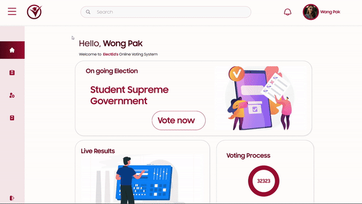

# ElectEd

ElectEd is a secure voting platform for students, designed to replace traditional methods with a more reliable, transparent, and user-friendly solution.

## Demo

Insert gif or link to demo

## Functional Requirements

- #### User Authentication
    Description: The system must allow users (students, and administrators) to login their account using their institutional email.
    

- #### Candidate Management
    The system should allow administrators to register candidates running for different positions. Each candidate will have a profile with details such as name, course, year level, and position.
   

- #### Voting Process
    The system must provide a secure and user-friendly interface for students to vote for their preferred candidates during the election period.
 

- #### Vote Tallying and Results Display
    After the election period, the system should automatically tally the votes and display the results in real-time.
 

- #### Role-based Access Control
    The system must have role-based access, allowing different users (students, and administrators) to access specific features. Administrators manage elections, while students can only vote.

- #### Election Reports Generation
    The system should generate detailed reports after the election, including voting statistics, voter turnout, and a breakdown of votes for each candidate.
 

## ERD

## User Interface
**landing page**

**dashboard/voting page**

