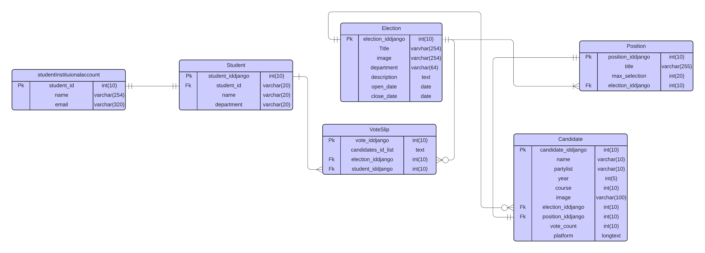
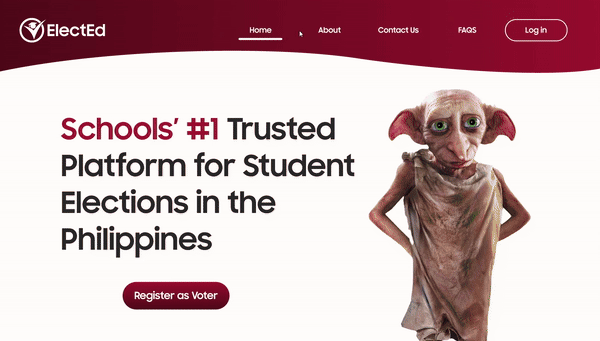
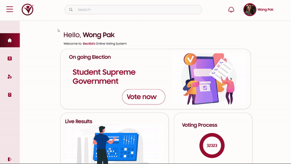

# 🗳️ **ElectEd: The Modern Online Voting System**

Welcome to **ElectEd**, the online voting platform designed to revolutionize university elections. With a focus on **simplicity**, **security**, and **scalability**, ElectEd ensures a seamless voting experience for students and administrators alike.

---

## 🌟 **Functional Requirements**

### 1. User Authentication
- **Description**: The system must allow users (students and administrators) to log in to their accounts using their institutional email.

### 2. Candidate Management
- **Description**: Administrators have the ability to efficiently register candidates running for various positions in upcoming elections. Each candidate's profile can be enriched with essential details, such as:
  - **Name**: Full name of the candidate.
  - **Course**: Academic course or program the candidate is enrolled in.
  - **Year Level**: The candidate’s current year level in the university.
  - **Desired Position**: The specific position the candidate is contesting for in the election (e.g., President, Vice President).
  - **Desired Election**: The election the candidate is running in (e.g., Student Council, Department Elections).
  - **Profile Image**: Upload a profile image of the candidate to enhance their visibility.
  - **Platform**: A section to outline the candidate’s campaign platforms and promises to engage voters.

### 3. Election Status Management
- **Description**: The system supports a clear distinction between elections based on their current status. Elections are categorized into three types:
  - **Active Election**: These are elections that are currently ongoing. Students can cast their votes during this period.
  - **Upcoming Election**: These are elections that are scheduled to take place in the future. Administrators can manage and prepare for these elections in advance, but students cannot vote yet.
  - **Inactive Election**: Elections that have already concluded or are no longer active. No further actions (like voting) are allowed, but the results can be viewed.

### 4. Voting Process
- **Description**: The system provides a secure and user-friendly interface for students to vote for their preferred candidates during the election period.

### 5. Vote Tallying and Results Display
- **Description**: After the election period, the system automatically tally the votes and display the results in real-time.

### 6. Role-based Access Control
- **Description**: The system have role-based access, allowing different users (students and administrators) to access specific features. Administrators manage elections, while students can only vote and view results.

### 7. Election Reports Generation
- **Description**: The system generates detailed reports after the election, including voting statistics, voter turnout, and a breakdown of votes for each candidate.

---

## 📊 **Entity-Relationship Diagram (ERD)**

---

## 🎨 **User Interface Previews**

### **Landing Page**

### **Dashboard/Voting Page**

---

## 🛠️ **Languages and Tools**

### Backend

### Database Management System (DBMS)

### Framework

### Frontend

### UI/UX Design

---

## 📂 **Quick Links**

- [**Entity-Relationship Diagram (ERD)**](https://lucid.app/lucidchart/6e09249c-0f5d-4596-8974-a15dbbba42b6/edit?viewport_loc=-1128%2C-686%2C3054%2C1441%2C0_0&invitationId=inv_816a19d8-e5e5-4b98-b584-7c563652fcbf)  
- [**UI/UX Design (Figma)**](https://www.figma.com/design/7Ea0jiaHDyttc6uYgjvAzE/FIGMA-PROJECTS?node-id=746-955&t=6q5gjlDmc9mi06Cr-1)  
- [**Gantt Chart**](https://cebuinstituteoftechnology-my.sharepoint.com/:x:/g/personal/johnmark_econar_cit_edu/EbW35uG6l5REuPsFjlDHpuQBZt89CwVZcSAsOVjD5R5soA?e=SK6QRP)  

---

## Project Members

- **Abadiano, Jan Edward**
- **Carreon, John Loi**
- **Econar, John Mark**
  
---
## 🚀 **Transforming Elections, One Vote at a Time**

ElectEd combines modern technology with the principles of democracy to create an inclusive, efficient, and trustworthy voting platform.

---
